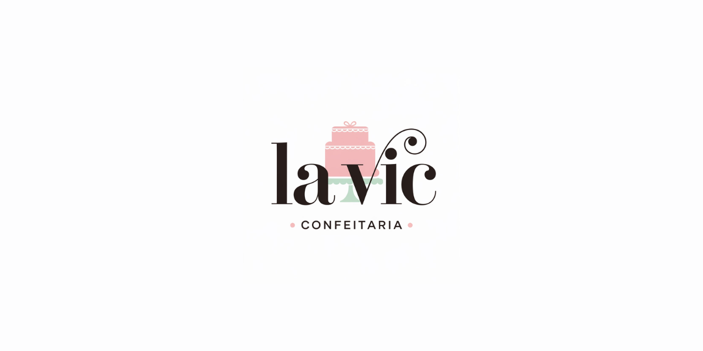

         

# 🍰 Confeitaria La Vic - Sistema Web

Este repositório contém o desenvolvimento do site oficial da **Confeitaria La Vic**, uma confeitaria real especializada em doces artesanais, localizada na cidade de São Paulo. Este projeto foi desenvolvido como parte do **Projeto Integrador da UNIVESP** com o objetivo de apoiar o crescimento da marca e oferecer uma plataforma digital eficiente para clientes e administração.

---

## ✨ Funcionalidades

### Área do Cliente
- Cadastro de novos clientes
- Realização de pedidos online
- Acompanhamento do status do pedido
- Acesso ao histórico de pedidos

### Área do Administrador
- Visualização de todos os pedidos realizados
- Atualização do status dos pedidos (ex: "em preparo", "pronto", "entregue")
- Acesso ao histórico completo de pedidos de todos os clientes

---

## 👨‍💻 Tecnologias Utilizadas

- HTML5
- CSS3
- Bootstrap
- JavaScript (Vanilla)
- PHP
- MySQL

---

## 👥 Integrantes do Projeto

- Danrlei Graia Dos Santos
- Fabiano Andrade Pinheiro
- Gustavo Milan De Farias
- Karen Kuniyoshi Nakaoka
- Hiel Souza De Freitas
- João Victor Dos Santos Sales
- Luiz Felipe Freitas Ribeiro

---

## 📝 Licença

Este projeto está licenciado sob a **Creative Commons BY-NC 4.0**.  
Ou seja, pode ser compartilhado e adaptado, **desde que não seja usado para fins comerciais** e que os devidos créditos sejam mantidos.

Mais detalhes: [https://creativecommons.org/licenses/by-nc/4.0/](https://creativecommons.org/licenses/by-nc/4.0/)

---

## 📣 Aviso

Este é um projeto acadêmico criado com a permissão da marca **La Vic**. O código e design aqui presentes foram elaborados **exclusivamente para fins educacionais** no contexto da UNIVESP.